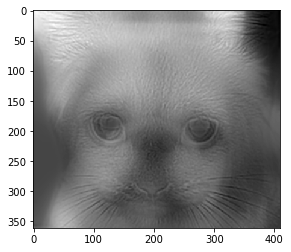

Fait par Martin Chauvin et Théo Ponton le 22/03/2018

# Implémentations d'images hybrides

Le but de notre travail est de réaliser des images hybrides. C'est à dire qu'à l'aide d'une image1 (par exemple un chat) et d'une image2 (par exemple un chien), il s'agit de créer une image composée des 2 appelée image hybride. Elle est de telle sorte que lorsqu'on la regarde de près, on voit l'image1 (le chat ici) et lorsqu'on la regarde de loin, on voit l'image2 (le chien). 



## Algorithme global

L'idée pour réaliser ces images, c'est d'appliquer un filtre passe-bas sur le chat et un filtre passe-haut sur le chien. Ainsi, de près on verra plus les basses fréquences et de loin les hautes fréquences. 

L'algorithme est le suivant :

- **Descente de la pyramide gaussienne** : sur l'une des images, nous allons appliquer un filtre gaussien d'une taille 7x7 qui va flouter l'image puis nous allons réduire la taille de l'image par 2. Sur la nouvelle image obtenue, nous repasser le même filtre gaussien puis à nouveau diviser la taille de l'image par deux. Le flou de l'image va permettre d'avoir une image moyennée et donc des basses fréquences.
- **Descente de la pyramide laplacienne** : sur la seconde image, nous allons lui soustraire un filtre gaussien appliqué à elle-même puis diviser la taille par 2. Sur l'image obtenue, nous allons à nouveau lui soustraire le filtre gaussien appliqué à cette dernière et ainsi de suite. Cette opération revient à enlever la moyenne à l'image. En enlevant la moyenne à une image, il reste juste les détails qui sont en réalité les hautes fréquences. 
- **Remontée de la pyramide** : On choisi ensuite un N qui sera l'image de la pyramide à partir de laquelle on commence la remontée. A chaque étape, on augmente la taille de l'image par 2 et on y ajoute l'image venant de la pyramide laplacienne et l'image venant de la pyramide gaussienne. Chacune de ces trois images sera multipliée par un coefficient différent. En jouant sur ce coefficients, nous pourrons ajouter l'importance de chacune des images. Et l'on recommence le processus jusqu'à avoir une image de la taille des images de base. 

## Pyramides gaussiennes et laplaciennes

Nous avons donc dans un premier temps créé un fonction qui va générer les pyramides gaussiennes et laplaciennes. 

```python
def create_pyramid(img, pyramid=[], effect='gaussian'):
    n,m = img.shape
    if effect=='gaussian':
        img_blur = cv2.GaussianBlur(img, (7,7),2)
    else :
        img_blur = cv2.GaussianBlur(img, (7,7),2)
        img_blur = cv2.Laplacian(img_blur,cv2.CV_64F)
    img_downsampled = img_blur[::2,::2]
    pyramid.append(img_downsampled)
    if n/2 < 2:
        return pyramid
    else:
        return create_pyramid(img_downsampled, pyramid, effect)
```

Notre fonction prend en entrée une image *img* en niveau de gris. *pyramid* est une liste composée des images obtenues lors des étapes précédentes de la descente de la pyramide. *effect* choisi si le filtre est *gaussian* ou *laplacian*. 

Nous faisons donc un test pour savoir quel type de filtre est appliqué. Selon le filtre, nous créons une image *img_blur* qui va contenir le resultat du filtre. Dans *img_downsampled* nous allons réduire la taille de l'image par 2. Puis nous allons ajouter cette image à la liste *pyramid*. Enfin, si la taille de notre image est plus petite que 4, on arrête la descente de la pyramide. Sinon, on rappelle la fonction avec *img_downsampled* et la liste *pyramid* ainsi complétée. 

## Remontée de la pyramide

Une fois que nous avons nos deux listes d'images : une pour la pyramide gaussienne et une pour la pyramide laplacienne, il est temps de créer notre image. Pour cela, nous avons créé une fonction *hybrid_img*. 

```python
def hybrid_img(gaus, lap, N, coeff_gaus_resize = 1, coeff_gaus_original = 1, coeff_lap = 1):
    img_gau = gaus[-N]
    for i, img_lap in enumerate(lap[-N-1::-1]):
        img_gau = cv2.resize(img_gau, img_lap.T.shape)
        img1 = gaus[-N-i-1]
        img = img_gau * coeff_gaus_resize + img1*coeff_gaus_original + img_lap * coeff_lap
    # Image view real close
    plt.figure(figsize=(12,12))
    plt.title('Close view')
    plt.imshow(img,'gray')
    # Image view real far
    plt.figure(figsize=(1,1))
    plt.title('Far view')
    plt.imshow(cv2.GaussianBlur(cv2.resize(img, (int(img.shape[1]/5),int(img.shape[0]/5))), (5,5),1),'gray')
    plt.show()
```

Cette fonction prend donc en entrée la pyramide gaussienne *gaus* et la pyramide laplacienne *lap*, qui sont donc des listes d'images. Elle prend *N* qui est l'étage de la pyramide à partir duquel faire la remontée. Elle prend aussi les 3 coefficients *coeff_gaus_original*, *coeff_gaus_resize* et *coeff_lap* qui seront respectivement les poids de l'image gausienne à l'étape i, l'image venant de l'étape i-1, l'image laplacienne à l'étape i. Avec i designant l'étape de la remontée. 

Notre fonction va à chaque étape de la remontée sommer ces trois images modulées par leur coefficients multiplicateurs. 

Le bout de code à la fin permet d'afficher l'image en petit et l'image en grand pour donner l'impression de regarder de près pour la première et de loin pour la deuxième. Notons que pour la petite image, nous avons repasser un filtre gaussien pour empêcher l'image d'être pixélisée. 

## Résultats

